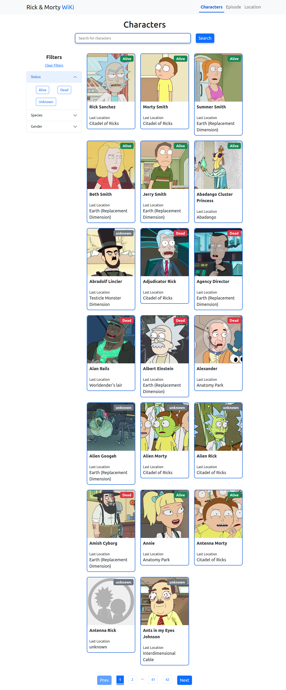

<h1 align="center"> Riki and Morty Character Wiki </h1>

## Índice

- [Descrição do Projeto](#descrição-do-projeto)
- [Screenshot](#screenshot)
- [Live Demo](#live-demo)
- [Tecnologias utilizadas](#tecnologias-utilizadas)

## Descrição do projeto

Um divertido catálogo onde é possível consultar, personagens, episódios, planetas e muito mais! Além de muito divertido esse projeto está repleto de recursos muito interessantes usados no React.

## Screenshot

## Live Demo

- Link do Site: [Link do Site](https://fagundesraphael.github.io/rick-and-morty-wiki/)

## Tecnologias utilizadas

- Semantic HTML5 markup
- Flexbox
- [React](https://reactjs.org)
- [JavaScript](https://www.javascript.com/)
- [SASS](https://sass-lang.com/)
- [Bootsrap](https://getbootstrap.com/)
